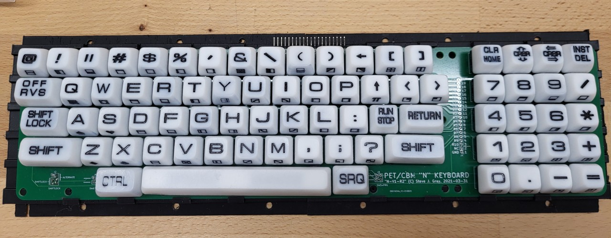
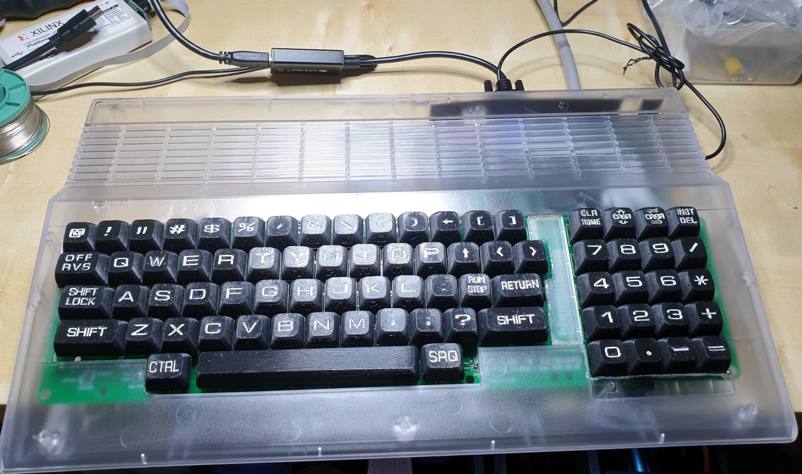

# Commodore PET keyboards

Note: this is a part of a larger set of repositories, with [upet_family](https://github.com/fachat/upet_family) as the main repository.

This is part of a re-incarnation of the Commodore PET computer(s) from the later 1970s.

This repo shows how to build a keyboard for the Commodore PET, mainly for my own re-incarnation, but potentially for original PET as well (untested).

Keyboards can be seen in the PETindex [keyboard section](http://www.6502.org/users/andre/petindex/keyboards.html).

## N-Type

This keyboard is the typewriter-stlye keyboard used in most 40 column models, except for the originals with the chicklet keyboard.

### PCB and support

#### Open source by Steve Gray

For my builds I am using the N-type keyboard PCB by Steve Gray from his [MX replacement keyboards projects](http://cbmsteve.ca/mxkeyboards/index.html)

As Steve only has the PCB, I designed a 3D-printable base support for the PCB.
It is available on tinkercad.

* [support structure for Steve's N-type keyboard at tinkercad](https://www.tinkercad.com/things/cUVlushPB3j-sjg-keybd-full-support-v07).

#### Texelec Petskey keyboard

This is the PET N-type keyboard available from Texelec.

As this is the PCB only, I have created a support structure for this too. Note, however, as I now prefer Steve's PCB, I only have an old version of the supports on tinkercad.

Two of each of these supports make up a keyboard base plate, where you only need to clip in the PCB for the keyboard with the mounted key switches. Then they have about the same dimensions as a C64 keyboard, and you can use them on top of the C64 keyboard support stands.

* [Petskey 1.0 keyboard on Texelec](https://texelec.com/product/petskey/)
* [Petskey support on tinkercad](https://www.tinkercad.com/things/5lenSoehSRu-petskey-full-support-plate)

### Key caps

There are two options, either use standard key caps, or 3D-printed ones.

#### Standard Keycaps

As, for the self-built keyboards from option 1 or 2 some standard MX switches are used, standard
key caps can be used as well. There is one caveat, however.

Newer key caps typically have a different inclination for each row of keys, that is the angle of the top key surface against the horizontal
is different for each row. This is to facilitate easier typing. In fact even the C64 keyboard has this.
The old PET keyboards, however, have the same angle - which is not zero! - for all rows. This makes it easier to use the same cap (in terms of physical dimensions)
on all rows, and just print on a different character for each key. Read more on those [key profiles](https://switchandclick.com/sa-vs-dsa-vs-oem-vs-cherry-vs-xda-keycap-profiles/).

I used two type of standard key caps:

1. [XDA profile, unmarked](https://www.amazon.de/gp/product/B06XSHK528/): this set of key caps does not have a print on it, and all keys have the same angle - zero. So it is
possible to use any of the key caps in any row. Which is important, as you need a specific number of keys for each key width.
Also, this set has space bars in different lengths, and there is one that fits the 6.25 character wide space bar for the petskey and sjg keyboards.
For the markings I just used a pen...

2. This one [Glorious PC Gaming Race ABS Doubleshot black, ANSI layout GAKC-045](https://www.caseking.de/glorious-pc-gaming-race-abs-doubleshot-schwarz-ansi-us-layout-gakc-045.html) I actually bought more or less
by accident. I only noticed that it has different angles per row when I tried it out. However, with the amount of caps I was able to only
use a wrong angle on Shift Lock, left Shift, Return and "4" - but it's barely noticable.
For the markings I used template from Steve's page, printed it on sticky paper, cut it out and glued it on the keys where the original did not fit.

#### Printed Keycaps

As a third option I used 3-D printed key caps that I designed myself.

The keycaps are made of three parts each:
1) a key form created by a parametric generator,
2) the top character print, extruded from the key form,
3) the front character (mostly the shifted character), extruded from the key form.

I created all parts, and integrated them in the [Tinkercad](https://tinkercad.com) web tool.

The key form is created using OpenSCAD by a [parametric generator](https://www.thingiverse.com/thing:2783650) (by Thingieverse user rsheldiii, published under the [CC BY-SA 3.0](https://creativecommons.org/licenses/by-sa/3.0/) license). Here is the [parameter file](keycaps/key_cbm3_customizer.scad). Only the key width needs to be adapted, and the inversion of the top for the space key.

Most of the top character prints are made from a [Microgramm font](https://www.wfonts.com/font/microgramma), converted to SVG using the [Font Squirrel](https://www.fontsquirrel.com/tools/webfont-generator) web page.

Some top characters, and especially the top words ("SHIFT", "RUN STOP" etc) are taken from [Steve's github page](https://github.com/sjgray/CBM-MX-Keyboards/tree/master/stickers). As SVG exported from inkscape did not work when imported
into tinkercad, I had to make screenshots from each character, and convert these screenshots into SVGs using this [online converter](https://image.online-convert.com/convert-to-svg).

The front characters are all from an [SVG file from wikipedia](https://en.wikipedia.org/wiki/Commodore_PET#/media/File:PET_Keyboard_improved.svg), from which I also took screenshots and converted to SVG as above.

You can find an oder version of the the STL files [here](keycaps/), in four parts due to its size. The current version is linked from tinkercad below.
Please note that it took me about 100+ hours just to print the full set of keys on my Snapmaker printer in high quality.
After printing you have to remove the supports that anchor the stem to the outside of the keycaps so it does
not break away when printing.

* [Keycaps for resin printing](https://www.tinkercad.com/things/5lsn5LsNa8Z-commodore-pet-caps-for-n-keyboard-m3-resin)
* [Master file for keycaps](https://www.tinkercad.com/things/d6KLWAxGR4K-master-commodore-pet-caps-for-n-keyboard)

### Switches

The PCBs work with standard Cherry-type/-compatible switches. I only tested Cherry brand switches, though. You may select depending on your preference regarding force needed, click noise etc.

I found the MX1A-C1NW a good compromise for me.

* [Cherry MX1A-C1NW at Mouser](https://www.mouser.de/ProductDetail/540-MX1A-C1NW)

## Gallery

, with key prints painted with black alcohol ink
, with key prints painted with white alcohol ink
, with key prints painted with white alcohol ink

 
